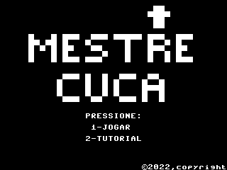

# Jogo de Organização e Arquitetura de Computadores

## Grupo

 * Guilherme Chiarotto de Moraes 12745229
 * Hugo Hiroyuki Nakamura 12732037
 * Isaac Santos Soares 12175173
 * Nicholas Estevão Pereira de Oliveira Rodrigues Bragança 12689616

---
## Link do video: 

[](https://drive.google.com/file/d/1Mo4v7wUalrIPz1OBkevBkAgSJY7zc-3n/view?usp=share_link)

## Jogo de cozinha (hamburgueria):

**_Objetivo:_** Completar comanda (pedido) corretamente para obter pontos. Há apenas uma comanda por fase. Erros no pedido causam perda de pontos.
Não haverá sistema de tempo.
Complexificação das comandas com pedidos vegetarianos, veganos ou com observações (ex: kids) que exigem modificação da receita padrão.
Só carrega um ingrediente por vez. Só pode pegar ingrediente se estiver com a mão vazia.
Bancada com ingredientes, com lixeira e com local de entrega dos ingredientes.
Movimentação apenas na horizontal. Espaço pega ingrediente, coloca na entrega ou descarta.
Há 8 ingredientes possíveis. Cada ingrediente é um número binário. Para adicionar um ingrediente ao prato basta fazer OR entre o ingrediente e o prato.
Obs: Possibilidade de implementação de livro de receitas (para criação de pratos complexos).
Não é possível descartar o prato nem remover ingrediente que foi adicionado.


## Estrutura do Jogo:
 ```
 
Opcao: var #1 // opção escolhida no menu.
Comandas: var #5  // vetor de todas as comandas definidas
ComandaAtual: var #1
Receitas: var #20 // todas as receitas possiveis no jogo
IndiceComandaAtual: var #1
Prato: var #1 // “Soma” dos ingrediente que o usuario colocou 
Ingrediente: var #1 // ingrediente na mao.
MaoVazia: var #1 // flag de 
NumeroPratosCorretos: var #1
NomeRestaurante: var #41
TeclaDigitada: var #1


main:
	Seta parâmetros e variáveis…
	ImprimeTelaOpcoes
	LoopMenu

LoopMenu:
	EntradaTeclado
	
	if (Opcao == tutorial)
		ImprimeTelaTutorial
		LoopMenu
	if (Opcao == iniciar)
		LerNomeRestaunte
		GerarComandas
		ImprimeTelaJogo
		LoopJogo
	if (Opcao == sair)
		FechaJogo

LoopJogo:
	EntradaTeclado
	
	if(TeclaDigitada == esquerda)
		moveEsquerda
	if(TeclaDigitada == direita)
		moveDireita
	if(TeclaDigitada == espaco)
		if(estaSobreBancada)
			PegaOuColocaOuDescartaIngrediente
		if(estaSobreCampainha) (Isaac e Guilherme)
			ComparaPratoComComanda 
			If(PratoEstaCorreto)
        AtualizaPontos
			  Incrementa IndiceComandaAtual
			If(IndiceComandaAtual == 6)
				FimDoJogo – Exibir tela final com pontuacao (Isaac e Guilherme)
			  ImprimeTelaJogo
	LoopJogo
	

LerNomeRestaurante:
	– Imprime tela ler nome do restaurante
	(Ler String jogo da Forca …)

EntradaTeclado:
	TeclaDigitada = 255
	LoopTeclado:
		TeclaDigitada = INCHAR
		if(TeclaDigitada == 255) //digitou nao digitou nada
			LoopTeclado

ImprimeTelaJogo: 
	AtualizaComanda	
	ImprimeComanda
	ImprimeBancada
	ResetaPrato
	
GerarComandas:
	(Usa nome do restaurante para gerar comandas)
	(Preenche vetor de comandas)

FimDoJogo:
	–Imprime tela de fim
  
 ```
 
 ---

## **TODO**

- [x] Funções
  - [x] main
  - [x] Loop Menu &emsp;&emsp;&emsp;&emsp;&emsp;&emsp; **_(Isaac)_**
  - [x] LoopJogo &emsp;&emsp;&emsp;&emsp;&emsp;&emsp;&emsp;**_(Hugo)_**
  - [x] EstaSobreCampainha &emsp;&emsp;**_(Isaac e Guilherme)_**
  - [x] AtualizaPontos &emsp;&emsp;&emsp; &emsp; **_(Isaac e Guilherme)_**
  - [x] EntradaTeclado **(Varias entradas mas nao uma função)**
  - [x] ImprimeTelaJogo
  - [x] GerarNumeroAleatoirio
  - [x] GerarComandas &emsp;&emsp;&emsp;&emsp;**_(Nicholas)_**
  - [x] FimDoJogo &emsp;&emsp;&emsp;&emsp;&emsp;&emsp;**_(Isaac e Guilherme)_**
 
- [x] Sprites
  - [x] Cenário
    - [x] Cozinha
    - [x] Bancada
      - [x] Campainha
      - [x] Prato **(Bandeija)**
    - [x] Pontuação  
    - [x] Comandas
  - [x] Ingredientes
  - [x] Personagem
  - [x] Telas
    - [x] Menu Principal
    - [x] Tutorial
	- [x] Fim de Jogo

- [ ] Encontrar e Arrumar Bugs
	- [ ] Erro de comanda errada (1 item só errado nao é contabilizado como errado)
